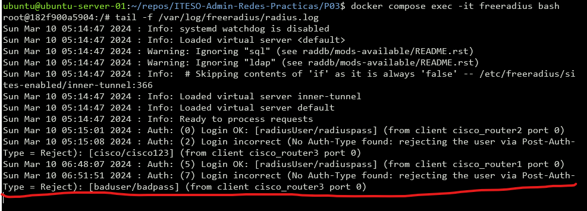

# Practice 3: RADIUS 

## Lab Layout

This is the layout at `proxmox` hypervisor.


> Note: `nic` are physical `NICs` and `vnic` are `Virtual NICs`

This is the `EVE-NG` lab layout, where `cloud2` is directly attached to `vnic2`


## IP Addressing

| Device        | Interface       | IP            | OSPF ID | OSPF Area |
|---------------|-----------------|---------------|---------|-----------|
| ubuntu-server | `ens19`/`vnic1` | 10.10.3.10/24 | NA      | NA        |
| R1            | `l0`            | 1.1.1.1       | 100     | 0         |
|               | `e1/0`          | 10.10.3.1/24  | 100     | 0         |
|               | `e1/2`          | 30.30.3.1/24  | 100     | 0         |
|               | `e1/3`          | 20.20.3.1/24  | 100     | 0         |
| R2            | `l0`            | 2.2.2.2       | 100     | 0         |
|               | `e1/0`          | 40.40.3.1/24  | 100     | 0         |
|               | `e1/1`          | 20.20.3.2/24  | 100     | 0         |
| R3            | `l0`            | 3.3.3.3       | 100     | 0         |
|               | `e1/1`          | 30.30.3.2/24  | 100     | 0         |
|               | `e1/2`          | 40.40.3.2/24  | 100     | 0         |

## Set Up

### Prerequisites

* Routers:
    - IPs assigned.
    - Loopback 0 interface.
    - Routing Protocol (Ex. OSPF)
    - Connectivity
    - Cloud Network attached to `vnic` at the same LAN that `ubuntu` VM.
* Ubuntu:
    - Minimum of 2 NICs
    - Netplan configured
    - Connectivity to the routers.
    - Docker

File Structure:
```
.
├── docker-compose.yaml
└── raddb
    ├── clients.conf
    ├── mods-config
    │   └── files
    │       └── authorize
    └── radiusd.conf

3 directories, 4 files
```

### Ubuntu

By connecting our `ubuntu` VM we need to add the following configuration to `netplan`.
We have 2 NICs, `ens18` and `ens19`, where `ens18` is the NIC bridged to my home network, receiving IP from DHCP, and finally `ens19` that is `vnic1` with IP `10.10.3.10` directly connected at the same lan that `vnic2` from `eve-ng` VM, also I added some routes, to access to the `loopback0` of each router by using `R1` as gateway with IP `10.10.3.1`.

Content of `/etc/netplan/00-installer-config.yaml`:
```yaml
# This is the network config written by 'subiquity'
network:
  ethernets:
    ens18:
      dhcp4: true
    ens19:
      addresses:
      - 10.10.3.10/24
      nameservers:
        addresses: []
        search: []
      routes:
        - to: 1.1.1.1/32
          via: 10.10.3.1
        - to: 2.2.2.2/32
          via: 10.10.3.1
        - to: 3.3.3.3/32
          via: 10.10.3.1
  version: 2
```

### FREERADIUS
To deploy `freeradius` server I used `docker` containers, because why not.

Content of `docker-compose.yaml`:
```yaml
version: '3.2'

services:
  freeradius:
    image: freeradius/freeradius-server
    container_name: freeradius
    volumes:
      - ./raddb/clients.conf:/etc/raddb/clients.conf
      - ./raddb/radiusd.conf:/etc/raddb/radiusd.conf
      - ./raddb/mods-config/files/authorize:/etc/raddb/mods-config/files/authorize
    ports:
      - 1812:1812/udp
      - 1813:1813/udp
```

Content of `./raddb/clients.conf`, here we declare the routers that `radius` is gonna manage, by adding its `ip`, `secret` and `nas_type`.
```
client cisco_router1 {
    ipaddr      = 1.1.1.1
    secret      = radiusSecret3
    nas_type    = cisco
}

client cisco_router2 {
    ipaddr      = 2.2.2.2
    secret      = radiusSecret3
    nas_type    = cisco
}

client cisco_router3 {
    ipaddr      = 3.3.3.3
    secret      = radiusSecret3
    nas_type    = cisco
}
```

Content of `./raddb/radiusd.conf`, here we indicate to `radius` server to grab logs at any of the following events: `auth`, `auth_badpass` and `auth_goodpass`.
```
...
        auth = yes
...
        auth_badpass = yes
        auth_goodpass = yes
...
```
> Note: Just modify these lines to the file. 

Content of `./raddb/mods-config/files/authorize`, here we create the `users` to log in into the routers, also we create a template once the user logged in.
```
radiusUser      Cleartext-Password := "radiuspass"
        Reply-Message := "Welcome, %{User-Name}"
```

### Routers
Set Up the routers to authenticate them by using `freeradius` server.

This command enables the AAA (Authentication, Authorization, and Accounting) infrastructure on the router. AAA is a framework for controlling access to computer resources based on user identities and is widely used in network security.
```
aaa new-model
```

This command specifies the default authentication method for login attempts. It instructs the router to first attempt authentication using a RADIUS server (specified by the "group radius" keyword), and if that fails, fall back to local authentication (using the local username/password database configured on the router).
```
aaa authentication login default group radius local
```

This command specifies the default authorization method for privileged EXEC (executive) mode access. It tells the router to first attempt authorization using a RADIUS server (specified by the "group radius" keyword), and if that fails, fall back to local authorization.
```
aaa authorization exec default group radius local
```

This command specifies the default accounting method for EXEC mode commands. It tells the router to send accounting records to a RADIUS server for every EXEC mode session, starting and stopping the recording of accounting information.
```
aaa accounting exec default start-stop group radius
```

This command configures the router to use a RADIUS server for authentication, authorization, and accounting purposes. It specifies the IP address of the RADIUS server, along with the ports for authentication (1812) and accounting (1813). The "key" parameter specifies the shared secret used to authenticate communications between the router and the RADIUS server.
```
radius-server host 10.10.3.10 auth-port 1812 acct-port 1813 key radiusSecret3
```

This command specifies the source interface (Loopback0 in this case) to be used for communications with the RADIUS server. This is useful for ensuring that RADIUS traffic originates from a specific interface on the router.
```
ip radius source-interface Loopback0
```

This command specifies the virtual terminal (VTY) lines on the router, which are used for remote management access.
```
line vty 0 15
```

This command specifies the default authentication method for the VTY lines. It instructs the router to use the authentication method named "default", which in this case was configured earlier to use RADIUS authentication as the primary method.
```
login authentication default
```

## Deploy

Once we set up, we can deploy our `freeradius` server by running:

```shell
docker compose up -d
```

```
NAME         IMAGE                          COMMAND                  SERVICE      CREATED       STATUS             PORTS
freeradius   freeradius/freeradius-server   "/docker-entrypoint.…"   freeradius   2 hours ago   Up About an hour   0.0.0.0:1812-1813->1812-1813/udp, :::1812-1813->1812-1813/udp
```
## POC

Tail following `/var/log/freeradius/radius.log` file at `freeradius` container.

Open a `shell` to `freeradius` container:
```shell
docker compose exec -it freeradius bash
```

Tail `/var/log/freeradius/radius.log` file:
```shell
tail -f /var/log/freeradius/radius.log
```

You should be watching the content like this:


### Good Pass
Now lets try login using `radiusUser` user and `radiuspass` password at any router:


Also we got the event at the log:


### Bad Pass
Now lets try login using any wrong credentials at any router:


Also we got the event at the log:


### No connection with `radius` server
By having no connection to `freeradius` server, the routers should use local credentials as authentication method.

To interrupt connection we can just stop the container:
```shell
docker compose stop freeradius
```

Now lets try login using `cisco` user and `cisco123` password at any router:


### Debug mode

To get more info from client (routers) about `radius` and `aaa` we can enable debug using:
```
debug aaa authentication
```

```
debug radius authentication
```

When `radius` server is down we catch:


When `radius` server is up we catch:


To disable debug modes use:
```
no debug aaa authentication
```

```
no debug radius authentication
```

## Conclusion

In summary, the network setup incorporates several key elements to establish robust authentication mechanisms:

Firstly, within the router configurations, I've leveraged AAA services to implement RADIUS for authentication, authorization, and accounting. By enabling AAA with "aaa new-model" and specifying RADIUS authentication and accounting parameters, I ensure secure access control for network resources.

In terms of virtualization, Proxmox serves as my hypervisor, hosting two virtual machines: one running EVE-NG for router emulation and another with Ubuntu Server. Through Proxmox's virtual networking capabilities, I've established connectivity between these VMs, crucial for testing and deployment.

For RADIUS functionality, I've deployed FreeRADIUS on the Ubuntu Server VM using Docker. This containerized setup allows for easy management and scalability of the RADIUS server. Configuring FreeRADIUS to communicate with my routers ensures centralized authentication, enhancing network security.

By integrating these components, I've created a dynamic network environment where routers authenticate users via a dedicated RADIUS server. This setup, facilitated by Proxmox, EVE-NG, and FreeRADIUS, empowers efficient testing and optimization of authentication mechanisms within my network infrastructure.

