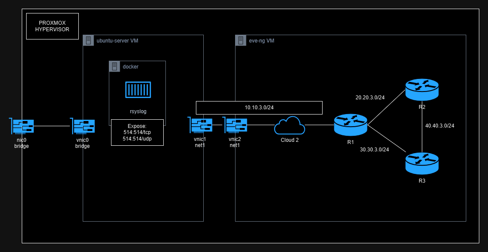
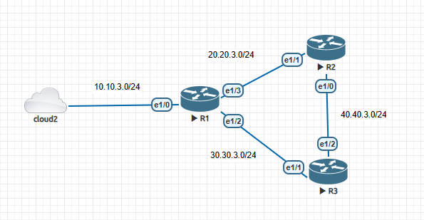
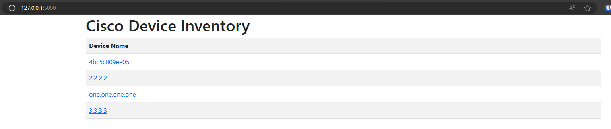
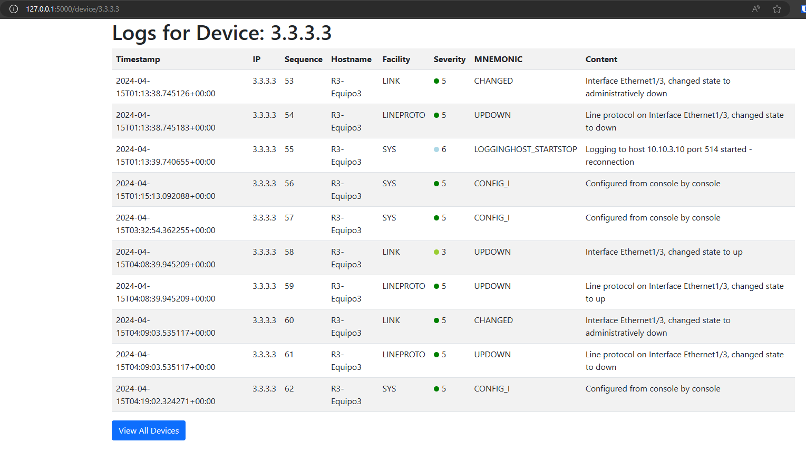
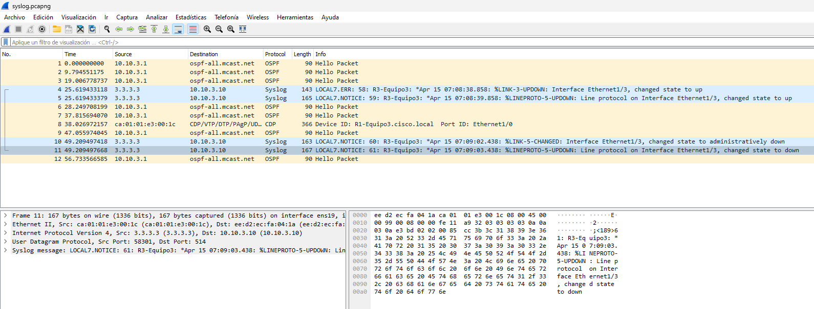
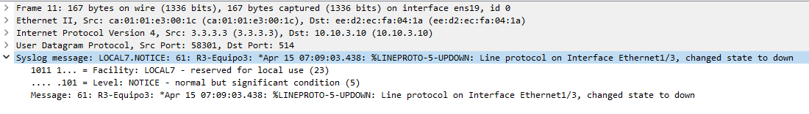

# Practice 4: Syslog

## Lab Layout

This is the layout at `proxmox` hypervisor.



> Note: `nic` are physical `NICs` and `vnic` are `Virtual NICs`

This is the `EVE-NG` lab layout, where `cloud2` is directly attached to `vnic2`



## IP Addressing

| Device        | Interface       | IP            | OSPF ID | OSPF Area |
|---------------|-----------------|---------------|---------|-----------|
| ubuntu-server | `ens19`/`vnic1` | 10.10.3.10/24 | NA      | NA        |
| R1            | `l0`            | 1.1.1.1       | 100     | 0         |
|               | `e1/0`          | 10.10.3.1/24  | 100     | 0         |
|               | `e1/2`          | 30.30.3.1/24  | 100     | 0         |
|               | `e1/3`          | 20.20.3.1/24  | 100     | 0         |
| R2            | `l0`            | 2.2.2.2       | 100     | 0         |
|               | `e1/0`          | 40.40.3.1/24  | 100     | 0         |
|               | `e1/1`          | 20.20.3.2/24  | 100     | 0         |
| R3            | `l0`            | 3.3.3.3       | 100     | 0         |
|               | `e1/1`          | 30.30.3.2/24  | 100     | 0         |
|               | `e1/2`          | 40.40.3.2/24  | 100     | 0         |

## Set Up

### Prerequisites

* Routers:
    - IPs assigned.
    - Loopback 0 interface.
    - Routing Protocol (Ex. OSPF)
    - Connectivity
    - Cloud Network attached to `vnic` at the same LAN that `ubuntu` VM.
* Ubuntu:
    - Minimum of 2 NICs
    - Netplan configured
    - Connectivity to the routers.
    - Docker

File Structure:
```
.
├── app.py
├── docker-compose.yaml
├── parse_logs.py
├── rsyslog
│   ├── config
│   └── logs
│       ├── debug
│       └── hosts
├── static
│   └── styles.css
└── templates
    ├── device_logs.html
    └── devices.html
```

### Ubuntu

By connecting our `ubuntu` VM we need to add the following configuration to `netplan`.
We have 2 NICs, `ens18` and `ens19`, where `ens18` is the NIC bridged to my home network, receiving IP from DHCP, and finally `ens19` that is `vnic1` with IP `10.10.3.10` directly connected at the same lan that `vnic2` from `eve-ng` VM, also I added some routes, to access to the `loopback0` of each router by using `R1` as gateway with IP `10.10.3.1`.

Content of `/etc/netplan/00-installer-config.yaml`:
```yaml
# This is the network config written by 'subiquity'
network:
  ethernets:
    ens18:
      dhcp4: true
    ens19:
      addresses:
      - 10.10.3.10/24
      nameservers:
        addresses: []
        search: []
      routes:
        - to: 1.1.1.1/32
          via: 10.10.3.1
        - to: 2.2.2.2/32
          via: 10.10.3.1
        - to: 3.3.3.3/32
          via: 10.10.3.1
  version: 2
```

### Rsyslog
To deploy `rsyslog` server I used `docker` containers, because why not.

Content of `docker-compose.yaml`:
```yaml
version: '3.2'

services:
  rsyslog:
    image: rsyslog/syslog_appliance_alpine:8.36.0-3.7
    container_name: rsyslog
    volumes:
      - ./rsyslog/config/rsyslog.conf:/etc/rsyslog.conf
      - ./rsyslog/logs:/logs
    ports:
      - 514:514/udp
      - 514:514/tcp
```

Content of `rsyslog/config/rsyslog.conf`:
```sh
...
# provides TCP syslog reception
$ModLoad imtcp
$InputTCPServerRun 514
$Modload imudp
$UDPServerRun 514
```

### Routers
Set Up the routers to send logs via `syslog` to `rsyslog` server.

Command to use `Loopback0` as main interface in syslog messages.
```
logging source-interface Loopback0
```

Command to add hostname inside syslog messages.
```
logging origin-id string <hostname>
```

Command to specify syslog logging severity level.
```
logging trap informational
```

Command to send all syslog messages to `rsyslog` server.
```
logging host <syslog-server> transport udp port 514
```
## Deploy

Once we set up, we can deploy our `rsyslog` server by running:

```shell
docker compose up -d
```

```
NAME      IMAGE                                        COMMAND                  SERVICE   CREATED       STATUS       PORTS
rsyslog   rsyslog/syslog_appliance_alpine:8.36.0-3.7   "/home/appliance/sta…"   rsyslog   4 hours ago   Up 3 hours   0.0.0.0:514->514/tcp, 0.0.0.0:514->514/udp, :::514->514/tcp, :::514->514/udp
```

Run the Flask app:

```shell
python3 app.py
```

Now you can see the logs via http://127.0.0.1:5000/

## POC

### Inspecting log files
After running rsyslog server, inside `logs/hosts/` directory we're gonna see many directories for each host sending syslog messages.

For example, we have 4 hosts, 3 routers: `2.2.2.2`, `3.3.3.3` and `one.one.one.one`, and our `rsyslog` server: `4bc5c009ee05`.
Each host's directory has a `messages.log`, containing the syslogs of the host.
```
.
├── debug
└── hosts
    ├── 2.2.2.2
    │   └── messages.log
    ├── 3.3.3.3
    │   └── messages.log
    ├── 4bc5c009ee05
    │   └── messages.log
    └── one.one.one.one
        └── messages.log

5 directories, 5 files
```

For example, by inspecting `2.2.2.2/messages.log`, this is the content:
```log
2024-04-15T01:12:35.764113+00:00 2.2.2.2 46: R2-Equipo3: *Apr 15 04:12:34.695: %LINK-3-UPDOWN: Interface Ethernet1/2, changed state to up
2024-04-15T01:12:35.764113+00:00 2.2.2.2 47: R2-Equipo3: *Apr 15 04:12:35.695: %LINEPROTO-5-UPDOWN: Line protocol on Interface Ethernet1/2, changed state to up
2024-04-15T01:15:22.276962+00:00 2.2.2.2 48: R2-Equipo3: *Apr 15 04:15:21.223: %SYS-5-CONFIG_I: Configured from console by console
2024-04-15T01:15:22.276962+00:00 2.2.2.2 49: R2-Equipo3: *Apr 15 04:15:21.871: %LINK-5-CHANGED: Interface Ethernet1/2, changed state to administratively down
2024-04-15T01:15:23.917317+00:00 2.2.2.2 50: R2-Equipo3: *Apr 15 04:15:22.871: %LINEPROTO-5-UPDOWN: Line protocol on Interface Ethernet1/2, changed state to down
```

> Note: `debug` file contains debug info from rsyslog service

### Web UI
This is the list of devices sending logs to `rsyslog` server:


Logs from `3.3.3.3` device:


### Analyze Packet Capture

Start the capture over the nic attached to the routers.
```shell
tshark -i ens19 -w ./syslog.pcapng
```

Simulate syslog messages, in this case we're gonna set a cpu threshold to generate a log with severity one.
```
process cpu threshold type total rising 1 interval 5
```

Simulate syslog messages, in this case we're gonna turn on/off an unused interface.
```
int e1/3
```
```
no shut
```
```
no shut
```

Stop the capture by pressing `CTRL-C`.

Then open the generated file `syslog.pcapng` with `wireshark`.


This is the content of one of the syslogs packets.


## Conclusion: Cisco Router Log Centralization and Visualization Lab

In this practical exercise, we have built a comprehensive lab for centralizing and visualizing logs from Cisco routers using a Dockerized Rsyslog server and a Flask web application. This lab has allowed us to:

**1. Log Centralization:**

* Set up a Dockerized Rsyslog server to centralize logs from multiple Cisco routers.
* Configured the routers to send their logs to the Rsyslog server using the syslog facility.
* Verified the reception and storage of logs on the Rsyslog server.

**2. Log Visualization:**

* Developed a Flask web application to visualize the centralized logs on the Rsyslog server.
* Implemented a web interface that displays logs by date, time, router, severity level, and content.
* Displayed logs with color-coded severity levels to facilitate prioritization.

**Benefits of the Lab:**

* Enhances network log visibility and control.
* Eases network problem detection and resolution.
* Simplifies auditing and compliance adherence.
* Provides an intuitive interface for log management.

**Conclusions:**

This lab has demonstrated the effectiveness of combining Rsyslog and Flask for centralizing and visualizing Cisco router logs. Log centralization enables more efficient network management, while interactive visualization with Flask facilitates the understanding and analysis of log data.

**Recommendations:**

* Implement this lab in a test environment before deploying it to production.
* Customize the Flask application according to the specific needs of the network.
* Integrate the lab with other network monitoring and management tools.

This lab has been a valuable hands-on experience in Cisco router log centralization and visualization. The skills and knowledge gained here can be applied in real-world network environments to improve operational efficiency and network security.

## References
- https://netplan.readthedocs.io/en/stable/examples/
- https://linuxconfig.org/how-to-add-static-route-with-netplan-on-ubuntu-20-04-focal-fossa-linux
- https://www.reddit.com/r/networking/comments/x5ohbg/eveng_on_proxmox_trying_to_figure_out_cloud_nodes/
- https://www.rsyslog.com/doc/installation/rsyslog_docker.html
- https://hub.docker.com/r/rsyslog/syslog_appliance_alpine
- https://networkproguide.com/configure-syslog-cisco-ios-switch-router/
- https://community.cisco.com/t5/switching/hostname-in-syslog/td-p/3605024
- https://www.cisco.com/c/en/us/td/docs/routers/access/wireless/software/guide/SysMsgLogging.html
- https://learningnetwork.cisco.com/s/question/0D53i00000KsuxQCAR/understanding-system-message-severity-levels
- https://gemini.google.com/
- https://community.snowflake.com/s/article/HOW-TO-GENERATE-PACKET-CAPTURE-FOR-SNOWFLAKE-CONNECTION