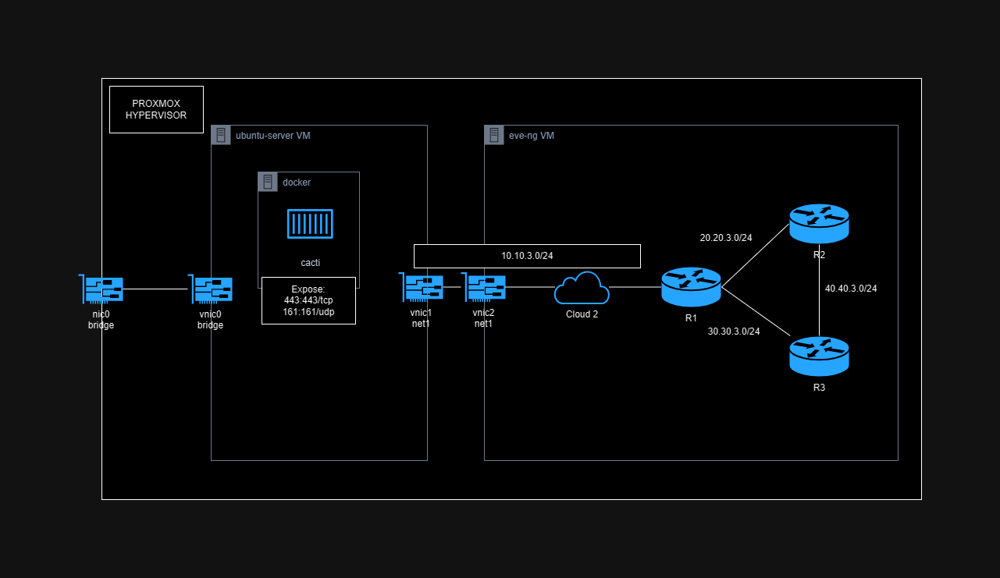
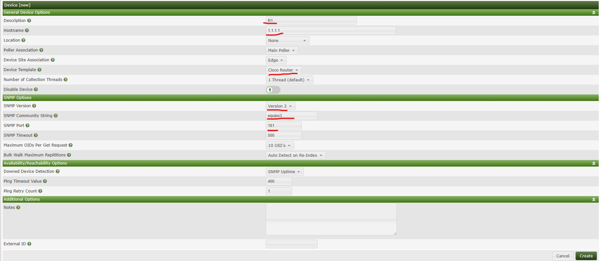
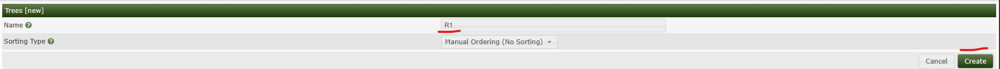
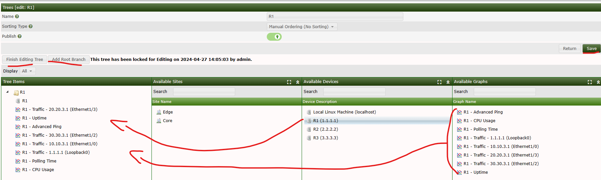
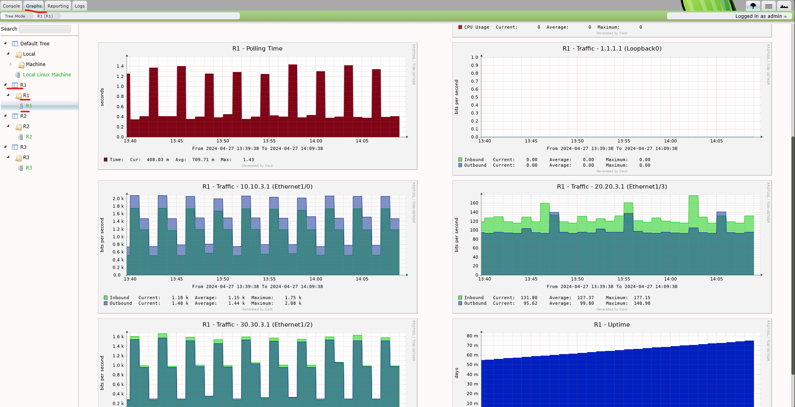
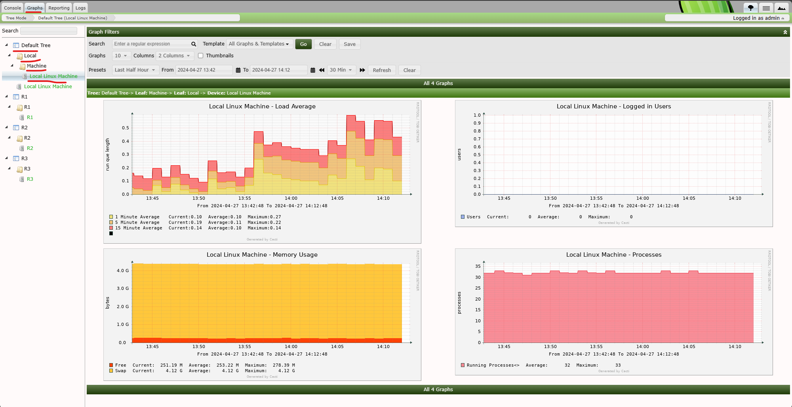
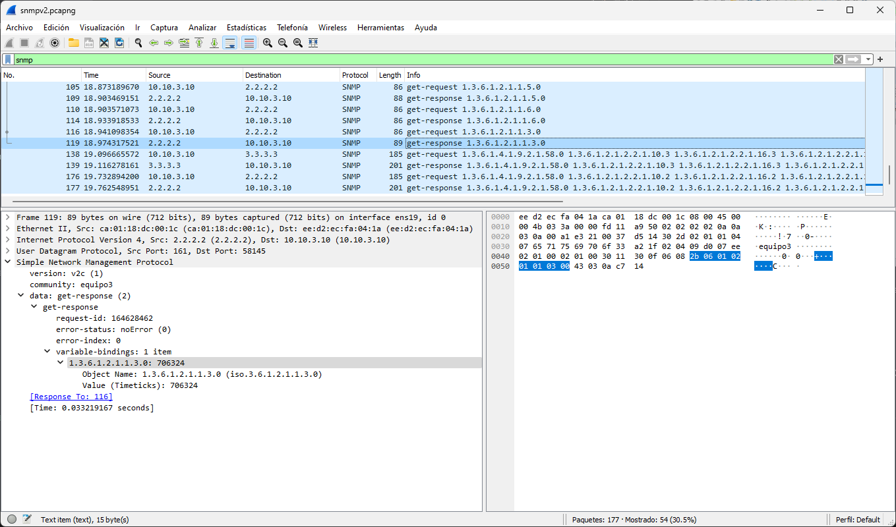
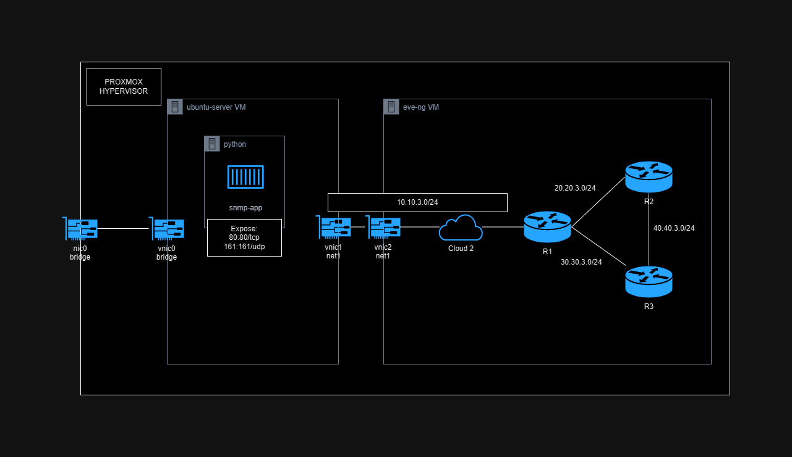
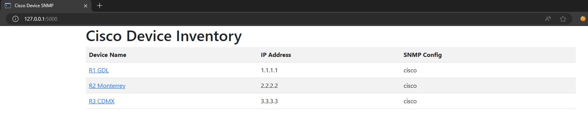
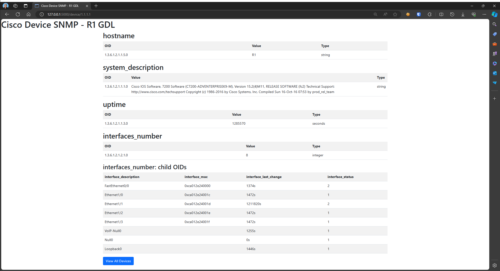

# Practice 5: SNMP

## Lab Layout
This is the `EVE-NG` lab layout, where `cloud2` is directly attached to `vnic2`


### IP Addressing

| Device        | Interface       | IP            | OSPF ID | OSPF Area |
|---------------|-----------------|---------------|---------|-----------|
| ubuntu-server | `ens19`/`vnic1` | 10.10.3.10/24 | NA      | NA        |
| R1            | `l0`            | 1.1.1.1       | 100     | 0         |
|               | `e1/0`          | 10.10.3.1/24  | 100     | 0         |
|               | `e1/2`          | 30.30.3.1/24  | 100     | 0         |
|               | `e1/3`          | 20.20.3.1/24  | 100     | 0         |
| R2            | `l0`            | 2.2.2.2       | 100     | 0         |
|               | `e1/0`          | 40.40.3.1/24  | 100     | 0         |
|               | `e1/1`          | 20.20.3.2/24  | 100     | 0         |
| R3            | `l0`            | 3.3.3.3       | 100     | 0         |
|               | `e1/1`          | 30.30.3.2/24  | 100     | 0         |
|               | `e1/2`          | 40.40.3.2/24  | 100     | 0         |

### Prerequisites
* Routers:
    - IPs assigned.
    - Loopback 0 interface.
    - Routing Protocol (Ex. OSPF)
    - Connectivity
    - Cloud Network attached to `vnic` at the same LAN that `ubuntu` VM.
* Ubuntu:
    - Python 3
    - Minimum of 2 NICs
    - Netplan configured
    - Connectivity to the routers.
    - Docker

File Structure:
```
.
├── attachments
│   ├── lab_layout_cacti.drawio
│   ├── lab_layout_cacti.png
│   ├── lab_layout_eve.png
│   ├── lab_layout_snmp_app.drawio
│   └── lab_layout_snmp_app.png
├── automation
├── cacti
│   └── docker-compose.yaml
└── README.md
```

### Ubuntu

By connecting our `ubuntu` VM we need to add the following configuration to `netplan`.
We have 2 NICs, `ens18` and `ens19`, where `ens18` is the NIC bridged to my home network, receiving IP from DHCP, and finally `ens19` that is `vnic1` with IP `10.10.3.10` directly connected at the same lan that `vnic2` from `eve-ng` VM, also I added some routes, to access to the `loopback0` of each router by using `R1` as gateway with IP `10.10.3.1`.

Content of `/etc/netplan/00-installer-config.yaml`:
```yaml
# This is the network config written by 'subiquity'
network:
  ethernets:
    ens18:
      dhcp4: true
    ens19:
      addresses:
      - 10.10.3.10/24
      nameservers:
        addresses: []
        search: []
      routes:
        - to: 1.1.1.1/32
          via: 10.10.3.1
        - to: 2.2.2.2/32
          via: 10.10.3.1
        - to: 3.3.3.3/32
          via: 10.10.3.1
  version: 2
```

## Cacti
This is the layout at `proxmox` hypervisor.



> Note: `nic` are physical `NICs` and `vnic` are `Virtual NICs`

### Installation
To deploy `cacti` server I used `docker` containers, because why not.

Content of `cacti/docker-compose.yaml`:
```yaml
services:
  cacti:
    image: "smcline06/cacti:1.2.17"
    container_name: cacti
    domainname: example.com
    hostname: cacti
    ports:
      - "80:80"
      - "443:443"
      - "161:161/udp"
    environment:
      - DB_NAME=${DB_NAME}
      - DB_USER=${DB_USER}
      - DB_PASS=${DB_PASS}
      - DB_HOST=${DB_HOST}
      - DB_PORT=${DB_PORT}
      - DB_ROOT_PASS=${MYSQL_ROOT_PASSWORD}
      - INITIALIZE_DB=${INITIALIZE_DB}
      - TZ=${TZ}
    volumes:
      - cacti-data:/cacti
      - cacti-spine:/spine
      - cacti-backups:/backups
    links:
      - db

  db:
    image: "mariadb:10.3"
    container_name: cacti_db
    domainname: example.com
    hostname: db
    ports:
      - "3306:3306"
    command:
      - mysqld
      - --character-set-server=utf8mb4
      - --collation-server=utf8mb4_unicode_ci
      - --max_connections=200
      - --max_heap_table_size=128M
      - --max_allowed_packet=32M
      - --tmp_table_size=128M
      - --join_buffer_size=128M
      - --innodb_buffer_pool_size=1G
      - --innodb_doublewrite=ON
      - --innodb_flush_log_at_timeout=3
      - --innodb_read_io_threads=32
      - --innodb_write_io_threads=16
      - --innodb_buffer_pool_instances=9
      - --innodb_file_format=Barracuda
      - --innodb_large_prefix=1
      - --innodb_io_capacity=5000
      - --innodb_io_capacity_max=10000
    environment:
      - MYSQL_ROOT_PASSWORD=${MYSQL_ROOT_PASSWORD}
      - TZ=${TZ}
    volumes:
      - cacti-db:/var/lib/mysql

volumes:
  cacti-db:
  cacti-data:
  cacti-spine:
  cacti-backups:
```

Content of `cacti/.env`:
```shell
DB_NAME=cacti_master
DB_USER=cactiuser
DB_PASS=cactipassword
DB_HOST=db
DB_PORT=3306
MYSQL_ROOT_PASSWORD=rootpassword
INITIALIZE_DB=1
TZ=America/Mexico_City
```

### Routers
Set up routers to enable `SNMPv2`.

Get into privileged mode.
```
enable
```

Get into config mode.
```
configure terminal
```

Enable `SNMPv2`.
```
snmp-server community equipo3 RW
```

Enable `cacti-server` as SNMP Server.
```
snmp-server host 10.10.3.10 version 2c equipo3
```
Where:
- `10.10.3.10` is IP for `cacti-server`
- `2c` version of `SNMP`
- `equipo3` community string.

### Add Device to Cacti
Go to homepage and click on `Create`, then click on `New Device`.
And fill the form:


### Add Graphs for Device in Cacti
Go to homepage and click on `Create`, then click on `New Graph`.
And fill the form:


### Add Tree for devices' graphs
Go to homepage and click on `Management`, then click on `Trees`.
Then click on `+` to add a tree.
And fill the form:


Once created, edit the tree, click on `Add Root Branch` and drag the device and their graphs inside the `Root Branch`. Also mark as `on` `Publish` field:


Click on `Finish Editing Tree` to save the changes,

### View your graphs
Go to `Graphs` section and expand the `R1` tree > `R1` > `R1`. You will be able to see the device's graphs.


### Add `cacti-server` to monitor by itself
By default the `cacti-server` (localhost) is added.
You can consult the graphs by going to `Graphs` section and expand the `Default Tree` > `Local` > `Machine` > `Local Linux Machine`. You will be able to see the `cacti-server`'s graphs.


### Analyze Packet Capture (SNMP)

Start the capture over the nic attached to the routers.
```shell
tshark -i ens19 -w ./snmpv2.pcapng
```
Wait few seconds and stop the capture by pressing `CTRL-C`.

Then open the generated file `syslog.pcapng` with `wireshark`.

This is the content of one of the `SNMP` packets.


Here you can see many data fields of `SNMP` such as:
- `version`: `SNMP` version
- `community`: String identifier for `SNMP`
- `get-response`: Response from client
    * `variable-blindings`: `OIDs` Items
        - `item`: `OID` Item
            * `Object Name`: `1.3.6.1.2.1.1.3.0`: `OID` Name
            * `Value`: `706324`: `OID` Value

### Conclusion

This practice successfully demonstrated the potential of Docker containers for deploying network monitoring tools like Cacti. The process involved:

* **Deploying Cacti in a Docker container:** This showcased the individual's understanding of containerization and its advantages for application deployment.
* **Enabling SNMP v2 on Cisco routers:** This granted Cacti access to valuable network data through SNMP.
* **Integrating network devices into Cacti:** The individual successfully integrated network devices into Cacti, allowing for centralized monitoring and data collection via SNMP.
* **Creating interface graphs:**  Interface graphs were created within Cacti, providing a visual representation of network traffic and performance.
* **Analyzing a pcapng capture containing SNMP data:** The ability to interpret network communication at a deeper level was demonstrated through the analysis of a pcapng capture containing SNMP data.

This combination of skills equips the individual to effectively monitor and analyze network performance using modern tools and techniques. This knowledge can be leveraged for troubleshooting network issues, optimizing resource allocation, and ensuring network health.

By continuing to explore and refine these skills, the individual can become a valuable asset in maintaining and optimizing network performance.

## Automation
This is the layout at `proxmox` hypervisor.



> Note: `nic` are physical `NICs` and `vnic` are `Virtual NICs`

### Web UI
This is the list of devices scraped by `python-snmp` server:


`SNMP` Metrics from `1.1.1.1` device:


### Installation
Go to `automation/`:
```shell
cd automation
```

Install `requirements.txt`:
```shell
pip3 install -r automation/requirements.txt
```

Define your device inventory, and OIDs to scrape at `config.yaml`:
```yaml
devices:
  - name: R1 GDL
    ip: "1.1.1.1"
    snmp_config: cisco
  - name: R2 Monterrey
    ip: "2.2.2.2"
    snmp_config: cisco
  - name: R3 CDMX
    ip: "3.3.3.3"
    snmp_config: cisco

snmp_configs:
  cisco:
    snmp:
      community: "equipo3"
    oids:
      - name: "hostname"
        oid: "1.3.6.1.2.1.1.5.0"
        type: "string"
      - name: "system_description"
        oid: "1.3.6.1.2.1.1.1.0"
        type: "string"
      - name: "uptime"
        oid: "1.3.6.1.2.1.1.3.0"
        type: "seconds"
      # - name: "memory"
      #   oid: "1.3.6.1.4.1.9.9.48.1.1.1.5.1"
      - name: "interfaces_number"
        oid: "1.3.6.1.2.1.2.1.0"
        type: "integer"
        sub_oids:
          - name: "interface_description"
            oid: "1.3.6.1.2.1.2.2.1.2"
            type: "string"
          - name: "interface_mac"
            oid: "1.3.6.1.2.1.2.2.1.6"
            type: "string"
          - name: "interface_last_change"
            oid: "1.3.6.1.2.1.2.2.1.9"
            type: "seconds"
          - name: "interface_status"
            oid: "1.3.6.1.2.1.2.2.1.8"
            type: "integer"
```

Run the `app`:
```shell
python3 app.py
```

### Conclusion
In our practice, we successfully leveraged Python libraries and a web framework to scrape SNMP metrics from network devices and visualize them through a user-friendly interface. Here's a breakdown of what we accomplished:

* **SNMP Data Acquisition:** We utilized the `pysnmp` library to interact with SNMP agents on network devices. By parsing a `config.yaml` file, we dynamically retrieved the target devices and OIDs to scrape. This showcases our ability to automate SNMP data collection based on configuration.
* **Flask Web App Development:** We implemented a web application using Flask to provide a user interface for the SNMP metrics. This demonstrates our understanding of web development frameworks and creating user-friendly interfaces for data visualization.
* **Data Integration:** We successfully integrated the SNMP data collected using `pysnmp` with our Flask application. This highlights our ability to combine different technologies to build a comprehensive solution.

Overall, this practice effectively demonstrates our skills in network data scraping, Python library usage, and Flask web development.

## Conclusion
In this comprehensive network management practice, we successfully employed various tools and techniques to gain valuable insights into network performance and health. Here's a summary of our accomplishments:

* **Automated SNMP Data Collection:** We leveraged Python's `pysnmp` library to automate the scraping of SNMP metrics from network devices. This demonstrates our ability to streamline data collection and reduce manual effort.
* **Cacti Server Deployment:** We deployed a Cacti server within a Docker container, showcasing our understanding of containerization technologies and their application in network monitoring.
* **SNMP Configuration and Monitoring:** We successfully enabled SNMP v2 on Cisco routers and integrated them with Cacti for automated data collection. This highlights our proficiency in configuring SNMP protocols and using monitoring tools to gain visibility into network behavior.
* **Data Visualization and Analysis:** We created informative graphs within Cacti to visualize interface-related metrics. Additionally, we analyzed a PCAPng capture containing SNMP data, demonstrating our ability to interpret captured network traffic and extract relevant information.

Overall, this practice effectively demonstrates a well-rounded skillset in network management, encompassing data acquisition automation, server deployment, SNMP configuration, data visualization, and network traffic analysis.

This combined approach empowers us to proactively monitor network performance, identify potential issues, and ensure optimal network operation.

## References
- https://www.cisco.com/c/en/us/support/docs/ip/simple-network-management-protocol-snmp/7282-12.html
- https://community.cisco.com/t5/switching/how-to-configure-snmp-v2c-on-switch/td-p/4156771
- https://www.manageengine.com/products/oputils/enable-snmp-cisco-router.html
- https://github.com/scline/docker-cacti
- https://hub.docker.com/r/smcline06/cacti/dockerfile