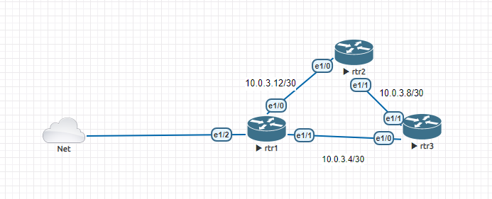

# Repo for Network Administration Practices

## Automation

### Enable connectivity between your host and devices in EVE-NG

I recommend to use a `10.0.0.0/8` space for your lab, because in this way is gonna be easier to connect to them from our host.

You need to connect a Cloud to the device you wanna manage, and set the ip using DHCP or static ip, depends on your home network.

Once you have an IP in the router at the same network that your host has, you have to add a route to access to `10.0.0.0/8`.

For Windows run:
```
route add 10.0.0.0 mask 255.0.0.0 <next-hop ip>
```

Also you can set up `loopback` interfaces like `1.1.1.1/32` and add the routes as follows:

For Windows run:
```
route add 1.1.1.1 mask 255.255.255.255 <next-hop ip>
```

Now you should be able to access to the edge router, but if you want to access to other routers that hasn't any cloud connection, you should enable a routing protocol such as EIGRP, OSPF, etc. In this way your edge router will be able to route the packets from your host to any router.

Topology Example:


### ENV Variables

Required environment variables for scripts:
- `CISCO_USERNAME`
- `CISCO_PASSWORD`
- `CISCO_SECRET`

Optional environment variables for scripts:
- `CISCO_PORT`

Using `.env` file at the same route of the script. You can use `.env.example` file for reference:
```
CISCO_USERNAME=
CISCO_PASSWORD=
CISCO_SECRET=
```

Or add the env variables manually:

For Windows Powershell:
```ps1
$env:MY_VAR = "value"
```

Example:
```ps1
$env:CISCO_USERNAME = "ciscoadmin"
```

For Linux:
```shell
export MY_VAR=value
```

Example:
```shell
export CISCO_USERNAME=ciscoadmin
```
